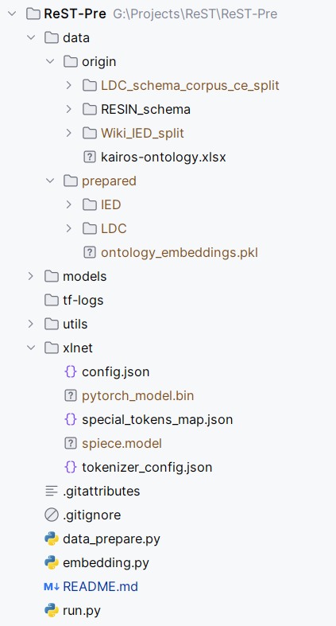

# ReST-Pre
ReST-Pre: Event Prediction by spatial-temporal Structural Replay on Generative Implicit Event Pattern Induction

The source data comes from https://github.com/limanling/temporal-graph-schema, and the corresponding data is placed in the `data/origin directory`

The file structure is as follows:

